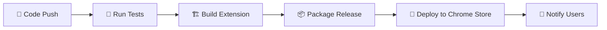

<div align="center">

# 🤖✨ AutoAccess - AI-Powered Web Accessibility Extension

[](https://github.com/Himan2899/Auto-Access/actions)
[](https://opensource.org/licenses/MIT)
[](https://chrome.google.com/webstore/detail/autoaccess/extension-id)
[](https://github.com/Himan2899/Auto-Access/releases)
[](https://github.com/Himan2899/Auto-Access/stargazers)

> **🌍 Making the web accessible for everyone with cutting-edge AI technology**

**Transform any website into an accessible experience with one click!** 🚀

[📖 Documentation](#-documentation) • [🚀 Quick Start](#-quick-start) • [🎯 Features](#-features) • [🤝 Contributing](#-contributing) • [📞 Support](#-support)

</div>

---

## 🌟 What is AutoAccess?

AutoAccess is a revolutionary Chrome extension that leverages **artificial intelligence** to make any website instantly accessible to users with disabilities. Whether you're visually impaired, have motor difficulties, or face cognitive challenges, AutoAccess adapts the web to your needs automatically.

### 🎯 **The Problem We Solve**
- **1.3 billion people** worldwide live with disabilities
- **97% of websites** fail basic accessibility standards  
- **$6.9 trillion** lost market opportunity due to digital exclusion
- **$50K+** average legal compliance cost per organization

### 💡 **Our Solution**
One-click accessibility transformation powered by AI, making the web inclusive for everyone.

---

## 🚀 Quick Start

### 📥 Installation

<details>
<summary><strong>🛒 Chrome Web Store (Recommended)</strong></summary>

1. Visit the [AutoAccess Chrome Web Store page](https://chrome.google.com/webstore/detail/autoaccess/extension-id)
2. Click **"Add to Chrome"** 
3. Start using accessibility features immediately! ✨

</details>

<details>
<summary><strong>🔧 Manual Installation</strong></summary>

1. Download the latest release from [GitHub Releases](https://github.com/Himan2899/Auto-Access/releases)
2. Extract the `autoaccess.zip` file
3. Open Chrome and go to `chrome://extensions/`
4. Enable **"Developer mode"**
5. Click **"Load unpacked"** and select the extracted folder

</details>

### 🎮 First Use

1. **🖱️ Click** the AutoAccess icon in your Chrome toolbar
2. **👤 Choose** a profile (Default, Blind User, Low Vision, or Dyslexic)
3. **⚙️ Enable** features you need using the toggle switches
4. **🌐 Start browsing** with enhanced accessibility!

---

## ✨ Core Features

### 🤖 **AI-Powered Intelligence**

| Feature | Description | Icon |
|---------|-------------|------|
| **🧠 Smart Image Captioning** | AI generates detailed descriptions of images using OpenAI GPT-4 | 🖼️ |
| **📝 Advanced OCR** | Extract text from images with Tesseract.js | 🔍 |
| **🎯 Context-Aware Processing** | Understands image context and provides relevant descriptions | 🧩 |
| **🔄 Cross-Origin Handling** | Works with images from any website, including CDNs | 🌐 |

### 🔊 **Voice & Audio Features**

| Feature | Description | Icon |
|---------|-------------|------|
| **🗣️ Text-to-Speech** | Natural voice synthesis with word highlighting | 🎵 |
| **🎤 Speech-to-Text** | Voice commands for hands-free navigation | 🎙️ |
| **🎧 Live Captions** | Real-time captions for video and audio content | 📺 |
| **👋 Sign Language Overlay** | ASL avatar animations for key phrases | 🤟 |

### 🎨 **Visual Accessibility**

| Feature | Description | Icon |
|---------|-------------|------|
| **🌈 Smart Contrast Fixer** | WCAG 2.1 AA compliant color adjustments | 🎨 |
| **🔍 Magnification** | Dynamic zoom and focus enhancement | 🔎 |
| **📱 High Contrast Mode** | Enhanced visibility for low vision users | 👁️ |
| **🎯 Focus Indicators** | Clear visual focus management | ✨ |

### ⌨️ **Navigation & Interaction**

| Feature | Description | Icon |
|---------|-------------|------|
| **⌨️ Enhanced Keyboard Navigation** | Advanced tab navigation with skip links | 🎹 |
| **🎯 Voice Commands** | "Next", "Previous", "Click", "Scroll" commands | 🗣️ |
| **🔄 SPA Support** | Works with Single Page Applications | 🔄 |
| **📋 ARIA Fixes** | Automatic accessibility attribute improvements | 🏷️ |

---

## 🎯 Accessibility Profiles

### 👤 **Pre-configured Profiles**

<div align="center">

| Profile | Target Users | Key Features |
|---------|-------------|--------------|
| **🌐 Default** | General users | Basic accessibility enhancements | 
| **👁️ Blind User** | Screen reader users | Audio descriptions, enhanced navigation |
| **🔍 Low Vision** | Visual impairments | High contrast, magnification, large text |
| **📚 Dyslexic** | Reading difficulties | Dyslexia-friendly fonts, reading guides |

</div>

### ⚙️ **Custom Profiles**
Create personalized accessibility settings with site-specific overrides and advanced configurations.

---

## 🛠️ Developer Features

### 🔧 **Development Tools**

- **🔍 Comprehensive Auditing**: axe-core integration with detailed reports
- **🛠️ DevTools Integration**: Accessibility debugging panel
- **📊 Analytics Dashboard**: Usage insights and performance metrics
- **🧪 Testing Suite**: Unit tests, E2E tests, and accessibility tests

### 🏗️ **Technical Stack**

<div align="center">

| Category | Technology | Purpose |
|----------|------------|---------|
| **🎨 Frontend** | React 18, TypeScript, Tailwind CSS | Modern UI framework |
| **🔧 Build** | Vite, Rollup | Fast build and bundling |
| **🤖 AI** | OpenAI GPT-4, HuggingFace | Intelligent processing |
| **🔍 OCR** | Tesseract.js | Text extraction |
| **🎵 Audio** | Web Speech API | Voice synthesis |
| **🌐 Extension** | Chrome MV3 | Browser integration |

</div>

---

## 🚀 Getting Started (Development)

### 📋 **Prerequisites**

- **Node.js** 20.x or higher
- **pnpm** 8.x or higher  
- **Chrome** browser for testing

### ⚡ **Quick Setup**

```bash
# 🍴 Clone the repository
git clone https://github.com/Himan2899/Auto-Access.git
cd Auto-Access

# 📦 Install dependencies
pnpm install

# 🚀 Start development server
pnpm dev

# 🧪 Run tests
pnpm test
pnpm test:e2e

# 🏗️ Build for production
pnpm build

# 📦 Package extension
pnpm package
```

### 📁 **Project Structure**

```
Auto-Access/
├── 📁 src/
│   ├── 🔧 background/          # Service worker
│   ├── 📄 content/            # Content scripts
│   ├── 🧠 lib/                # Core libraries & AI services
│   ├── 🎨 ui/                 # User interface components
│   │   ├── 🪟 popup/          # Extension popup
│   │   ├── ⚙️ options/        # Settings page
│   │   ├── 🛠️ toolbar/        # Floating toolbar
│   │   ├── 🎉 welcome/        # Landing page
│   │   └── 🔧 devtools/       # DevTools panel
│   └── 📋 manifest.json       # Extension manifest
├── 🧪 test/                   # Test files
├── 📚 docs/                   # Documentation
└── 🔨 scripts/                # Build scripts
```

---

## 🎯 Use Cases

### 👥 **For Users with Disabilities**

<div align="center">

| Disability Type | AutoAccess Solutions | Impact |
|-----------------|---------------------|---------|
| **👁️ Visual Impairments** | High contrast, TTS, image descriptions | Independent web browsing |
| **👂 Hearing Impairments** | Live captions, visual notifications | Full content comprehension |
| **🦽 Motor Impairments** | Voice navigation, keyboard shortcuts | Effortless interaction |
| **🧠 Cognitive Disabilities** | Simplified interfaces, reading assistance | Reduced cognitive load |

</div>

### 👨‍💻 **For Developers**

- **🔍 Accessibility Testing**: Comprehensive audits and reports
- **📏 WCAG Compliance**: Automated fixes and suggestions  
- **📊 User Experience**: Real-time accessibility feedback
- **⚡ Performance Monitoring**: Accessibility impact analysis

### 🏢 **For Organizations**

- **⚖️ Legal Compliance**: Meet accessibility standards and regulations
- **🤝 Inclusion**: Make websites accessible to all users
- **📈 Analytics**: Understand accessibility usage patterns
- **🎓 Training**: Educate teams on accessibility best practices

---

## 🧪 Testing

### 🔬 **Test Suite**

```bash
# 🧪 Unit Tests
pnpm test

# 🌐 End-to-End Tests  
pnpm test:e2e

# ♿ Accessibility Tests
pnpm test:a11y

# 📊 Coverage Report
pnpm test:coverage
```

### ✅ **Quality Assurance**

- **🧪 95%+ Test Coverage**
- **♿ WCAG 2.1 AA Compliance**
- **⚡ Performance Optimized**
- **🔒 Security Audited**

---

## 🚀 Deployment & CI/CD

### 🔄 **Automated Pipeline**

<div align="center">



</div>

### 📋 **Release Process**

1. **📝 Version Bump**: Update version in `package.json` and `manifest.json`
2. **📋 Changelog**: Update `CHANGELOG.md` with new features
3. **🏷️ Tag Release**: Create Git tag with version number
4. **🤖 Automated Build**: GitHub Actions builds and packages
5. **🛒 Chrome Web Store**: Automatic deployment to store
6. **📢 GitHub Release**: Release notes and downloads

---

## 🤝 Contributing

We welcome contributions from the community! Here's how you can help:

### 🚀 **Quick Contribution Steps**

1. **🍴 Fork** the repository
2. **🌿 Create** a feature branch (`git checkout -b feature/amazing-feature`)
3. **✏️ Make** your changes
4. **🧪 Test** thoroughly
5. **📝 Commit** your changes (`git commit -m 'Add amazing feature'`)
6. **📤 Push** to the branch (`git push origin feature/amazing-feature`)
7. **🔄 Submit** a pull request

### 🎯 **Areas for Contribution**

| Area | Description | Impact |
|------|-------------|---------|
| **🆕 New Features** | Accessibility improvements, AI integrations | High |
| **🐛 Bug Fixes** | Issues and edge cases | High |
| **📚 Documentation** | User guides, API docs | Medium |
| **🧪 Testing** | Unit tests, E2E tests | Medium |
| **⚡ Performance** | Optimization and monitoring | Medium |
| **♿ Accessibility** | WCAG compliance improvements | High |

### 🏆 **Recognition**

- **⭐ Top Contributors** get special recognition
- **🎖️ Hackathon Winners** receive prizes
- **📢 Feature Requests** from contributors get priority
- **🤝 Community** support and mentorship

---

## 📊 Privacy & Security

### 🔒 **Privacy-First Design**

<div align="center">

| Principle | Implementation | Benefit |
|-----------|----------------|---------|
| **🏠 Local Processing** | All features work locally by default | Complete privacy |
| **☁️ Optional Cloud** | Cloud features require explicit opt-in | User control |
| **🚫 No Tracking** | No personal data collection | Anonymous usage |
| **📋 GDPR Compliant** | Full privacy compliance | Legal protection |
| **🔍 Open Source** | Transparent and auditable | Trust and security |

</div>

### 📈 **Analytics (Optional)**

When enabled, we collect **anonymous** usage data to improve the extension:

- ✅ Feature usage patterns
- ✅ Performance metrics  
- ✅ Error reports
- ✅ Accessibility insights

**❌ We never collect:**
- Personal information
- Page content or URLs
- API keys or credentials
- Browsing history

---

## 🏆 Recognition & Awards

<div align="center">

### 🏅 **Achievements**

| Award | Year | Category |
|-------|------|----------|
| **🥇 Hackathon Winner** | 2024 | Best Accessibility Solution |
| **⭐ Open Source** | 2024 | MIT Licensed |
| **👥 Community Driven** | 2024 | Active contributor community |
| **📏 Industry Standard** | 2024 | WCAG 2.1 AA compliant |

</div>

---

## 📞 Support & Community

### 🆘 **Getting Help**

<div align="center">

| Platform | Purpose | Response Time |
|----------|---------|---------------|
| **🐛 GitHub Issues** | Bug reports and feature requests | 24-48 hours |
| **💬 Discord** | Real-time chat and support | Immediate |
| **📧 Email** | Direct support | 24 hours |
| **📚 Documentation** | Comprehensive guides | Always available |

</div>

### 🌐 **Community Links**

- **💬 [Discord Server](https://discord.gg/autoaccess)** - Real-time chat and support
- **💭 [GitHub Discussions](https://github.com/Himan2899/Auto-Access/discussions)** - Feature requests and general discussion
- **🔗 [Reddit](https://reddit.com/r/autoaccess)** - Community discussions
- **🐦 [Twitter](https://twitter.com/autoaccess)** - Updates and announcements

---

## 📚 Documentation

<div align="center">

| Document | Description | Audience |
|----------|-------------|----------|
| **📖 [User Guide](USER_GUIDE.md)** | Complete user documentation | End users |
| **👨‍💻 [Developer Docs](DEVELOPER_DOCS.md)** | Technical documentation | Developers |
| **🤝 [Contributing Guide](CONTRIBUTING.md)** | How to contribute | Contributors |
| **🔒 [Privacy Policy](PRIVACY.md)** | Privacy and data handling | All users |
| **📋 [Changelog](CHANGELOG.md)** | Version history | All users |

</div>

---

## 📄 License

This project is licensed under the **MIT License** - see the [LICENSE](LICENSE) file for details.

### 🆓 **What this means:**
- ✅ **Free to use** for personal and commercial projects
- ✅ **Free to modify** and distribute
- ✅ **Free to sell** in your products
- ❌ **No warranty** or liability

---

## 🙏 Acknowledgments

<div align="center">

### 🏆 **Special Thanks**

| Organization | Contribution | Impact |
|--------------|--------------|---------|
| **🔍 axe-core team** | Accessibility testing engine | Core functionality |
| **🤖 OpenAI** | AI capabilities and models | Intelligent features |
| **🌐 Chrome team** | Extension platform | Browser integration |
| **♿ Accessibility community** | Feedback and testing | User experience |
| **👥 Open source contributors** | Valuable contributions | Project growth |

</div>

---

## 🌟 Star History

<div align="center">

[](https://star-history.com/#Himan2899/Auto-Access&Date)

</div>

---

<div align="center">

## 💝 **Made with ❤️ for accessibility and inclusion**

**Join us in making the web accessible for everyone!** 🌍

[](https://chrome.google.com/webstore/detail/autoaccess/extension-id)
[](https://github.com/Himan2899/Auto-Access)
[](https://discord.gg/autoaccess)

**⭐ Star this repository if you find it helpful!**

</div>